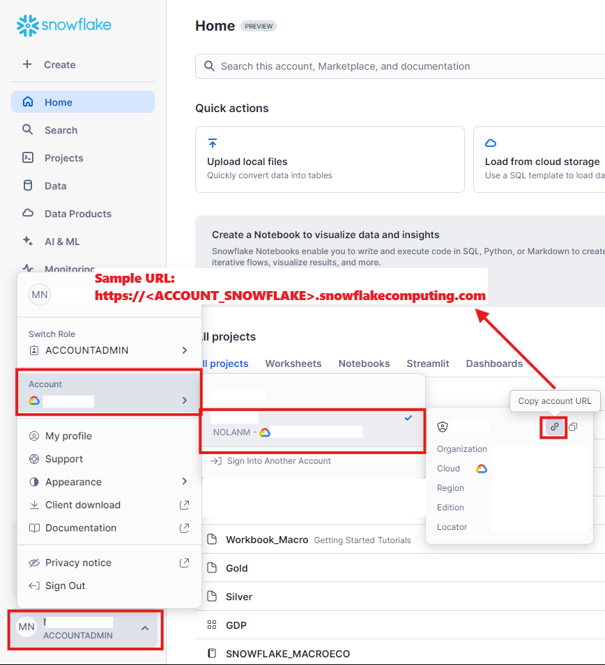
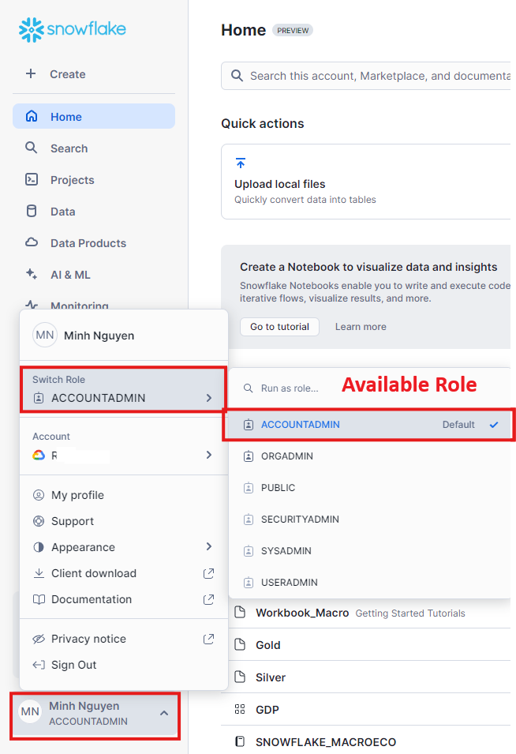
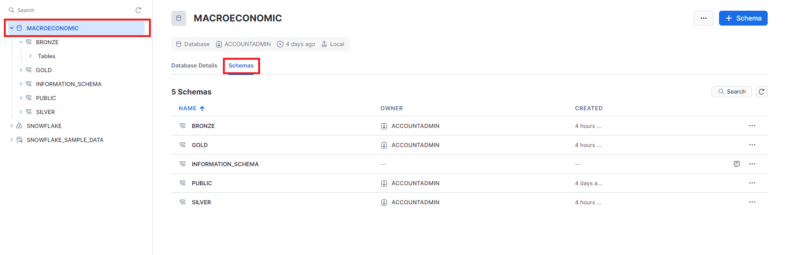

# How to Create a Snowflake Account, Log In, and Connect Using Python

## Follow the steps below to create a Snowflake account and retrieve connection information:

### 1. Create a Snowflake Account
1. **Visit the Snowflake Website**
   - Go to the [Snowflake website](https://signup.snowflake.com/) and sign up for a free trial or create an account.
   
2. **Fill in Your Details**
   - Provide your name, email address, company name, and other required information.
   
3. **Verify Your Email**
   - Check your email for a verification link from Snowflake and click the link to complete the account setup.

### 2. Log In to Snowflake
1. **Visit the Snowflake Login Page**
   - Go to the [Snowflake login page](https://app.snowflake.com/).

2. **Enter Your Credentials**
   - Use your account credentials (username and password) to log in to the Snowflake console.

3. **Locate Connection Information**
   - After logging in, navigate to the console dashboard to retrieve the following details for Python connection:
     - **Account URL with Account Name****
      <p align="center">
          
      </p>

     - **Username**
     - **Password**
     - **Role (e.g., SYSADMIN)**
      <p align="center">
          
      </p>

     - **Warehouse (e.g., COMPUTE_WH)**
         - Go to tab Admin --> Warehouses
     - **Database (e.g., MY_DB)**
         - Go to tab Data --> Databases
     - **Schema (e.g., PUBLIC)**
         - Go to tab Data --> Databases -> Schema
         <p align="center">
          
         </p>

### 3. Test Connect to Snowflake Using Python

1. **Install the Snowflake Connector for Python:**

   ```bash
   pip install snowflake-connector-python
   ```

2. **Set Up Environment Variables for Secure Access:**

   ```bash
   export SNOWFLAKE_USER="your_username"
   export SNOWFLAKE_PASSWORD="your_password"
   export SNOWFLAKE_ACCOUNT="your_account_url"
   export SNOWFLAKE_WAREHOUSE="your_warehouse"
   export SNOWFLAKE_DATABASE="your_database"
   export SNOWFLAKE_SCHEMA="your_schema"
   ```

3. **Connect to Snowflake in Python:**

   ```python
   import os
   import snowflake.connector

   # Retrieve credentials from environment variables
   user = os.getenv("SNOWFLAKE_USER")
   password = os.getenv("SNOWFLAKE_PASSWORD")
   account = os.getenv("SNOWFLAKE_ACCOUNT")
   warehouse = os.getenv("SNOWFLAKE_WAREHOUSE")
   database = os.getenv("SNOWFLAKE_DATABASE")
   schema = os.getenv("SNOWFLAKE_SCHEMA")

   # Establish the connection
   conn = snowflake.connector.connect(
       user=user,
       password=password,
       account=account,
       warehouse=warehouse,
       database=database,
       schema=schema
   )

   # Test the connection
   cursor = conn.cursor()
   cursor.execute("SELECT CURRENT_VERSION()")
   version = cursor.fetchone()
   print(f"Snowflake Version: {version[0]}")

   # Close the connection
   cursor.close()
   conn.close()
   ```

### Important:
- Keep your credentials secure by using environment variables and never expose your password or account URL publicly.
