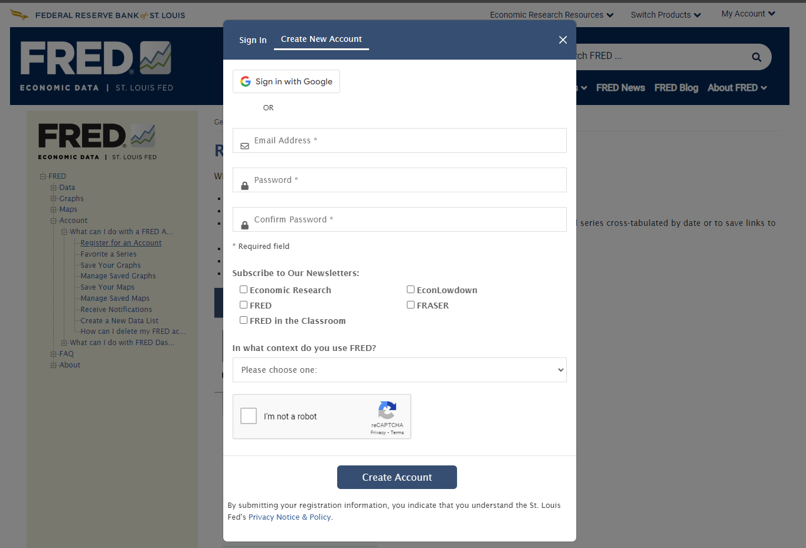
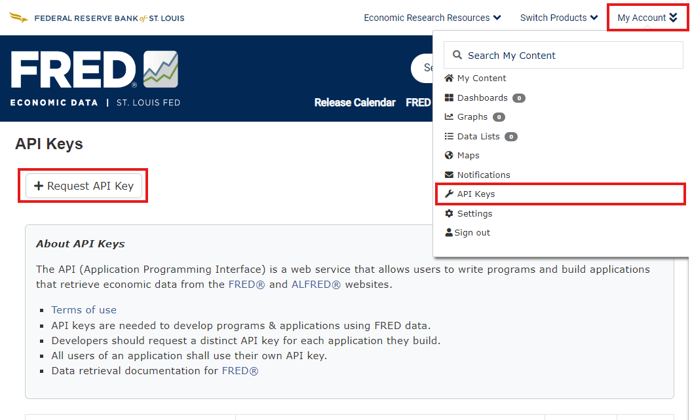

# How to Retrieve FRED API Keys

## Follow the steps below to obtain your FRED API key:

1. **Visit the FRED Website**
   - Go to the [FRED website](https://fred.stlouisfed.org/) and click on 'Create an Account' if you don't have one. If you already have an account, simply log in.

2. **Create a New Account (if needed)**
   - Provide your email, username, and password to create an account.
   - Verify your email if prompted.
   <p align="center">
      
   </p>

3. **Request API Key**
   - After logging in, go to the [API Keys Management Page](https://fred.stlouisfed.org/apikeys).
   - Click on 'Request API Key' and fill in the required details.
   - Once submitted, an API key will be generated and displayed on the screen.
   <p align="center">
      
   </p>

4. **Save the API Key**
   - Copy the generated API key and keep it secure. You will need it to authenticate API requests.

## Use the FRED API Key in Another Project

1. **Set the API Key as an Environment Variable:**

   ```bash
   export FRED_API_KEY="your_api_key_here"
   ```

2. **Access the API Key in Python:**

   ```python
   import os

   fred_api_key = os.getenv("FRED_API_KEY")
   print(fred_api_key)
   ```

3. **Use the API Key in Your Scripts:**
   - You can now use the `fred_api_key` variable to make API calls to the FRED service.

### Important:
- Keep your API key private and do not share it publicly to prevent unauthorized use.
