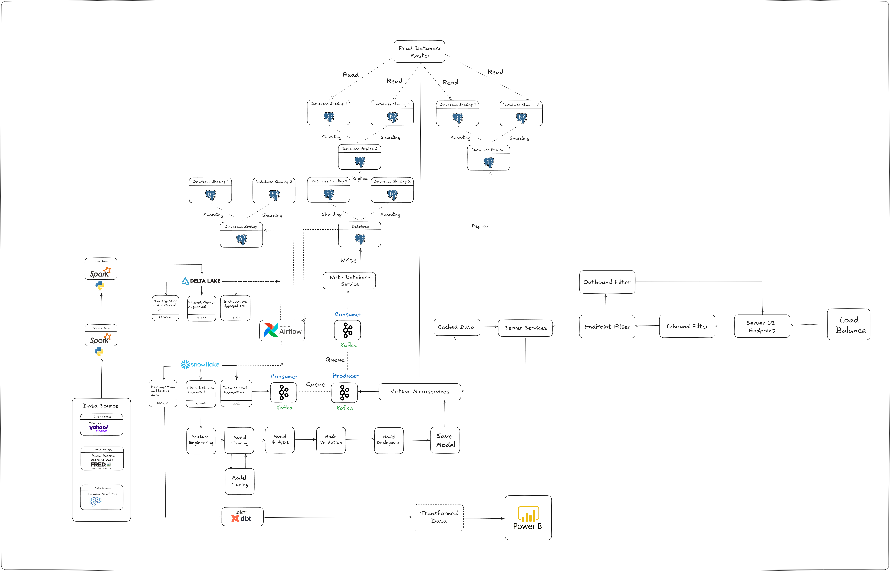

## I. Project Overview
The project aims to build a comprehensive system for analyzing the financial health of companies and predicting stock prices using historical macroeconomic data. The system will provide insights and forecasts, enabling better decision-making in financial investments.

---

## II. Tech Stack

##### 1. Data Collection & Preprocessing:
- **Python Libraries**: pandas, numpy, requests, yfinance, fredapi
- **APIs**: FRED (Federal Reserve Economic Data), yfinance

##### 2. Data Storage:
- **SQL Database** PostgreSQL for structured data storage
- **Snowflake Cloud Storage** for delta layers

##### 3. Data Analysis & Modeling:
- **Data Exploration**: pandas, matplotlib, seaborn
- **Feature Engineering**: scikit-learn
- **Models**:
  - **Company Health Analysis Model**: Random Forest, Gradient Boosting, XGBoost
  - **Stock Price Prediction Model**: Long Short-Term Memory (LSTM), Prophet, ARIMA for time series forecasting

##### 4. Model Evaluation:
- **Metrics**: R-squared, Mean Squared Error (MSE), Accuracy, Precision, Recall
- **Tools**: scikit-learn, TensorFlow/PyTorch (for deep learning models)

##### 5. User Interface:
- **Web Framework**: Streamlit and Flask (for web-based UI and APIs)
- **Frontend**: Streamlit UI components

---

## III. Project

#### 1. Objectives:
- Build a data-driven system that integrates historical macroeconomic data to analyze company health.
- Develop predictive models for stock price forecasting based on company and macroeconomic data.
- Create a user-friendly interface to provide insights and forecasts for investment decisions.

#### 2. Methodology

##### Data Collection
- Gather data from FRED API and yfinance.
- Store data in a structured format for analysis.

##### Data Preprocessing
- Clean and normalize the data.
- Engineer features for better model performance.

##### Modeling
- Build a health analysis model to classify companies based on financial stability.
- Develop a stock price prediction model using time series techniques.

##### Evaluation
- Validate models with real-world datasets.
- Adjust parameters to optimize accuracy and predictive power.

##### Deployment
- Develop a web-based UI for user interaction.
- Integrate models for real-time analysis and forecasting.

##### Expected Outcomes:
- Comprehensive analysis of company financial health based on macroeconomic data.
- Accurate prediction of stock prices for 1-month and 1-year timeframes.
- A user-friendly interface for investors and analysts.

#### 3. Resources Required:
- **Python libraries**: pandas, numpy, yfinance, fredapi, scikit-learn, TensorFlow/PyTorch, matplotlib, Streamlit, snowflake-connector-python
- **SQL Database** PostgreSQL
- **APIs**: FRED, yfinance
- **Cloud storage** Snowflake

---

## IV. Project Architecture

