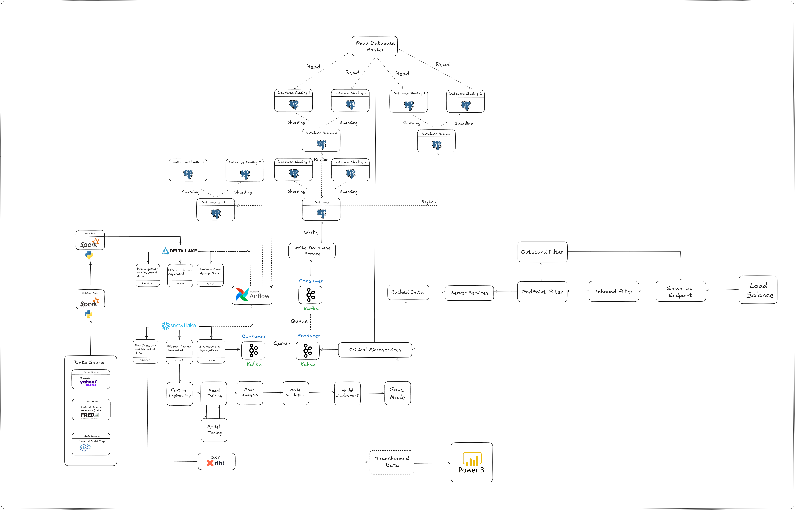
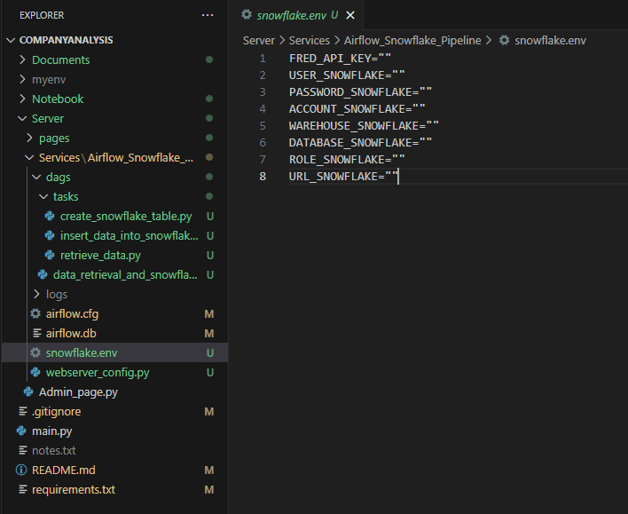
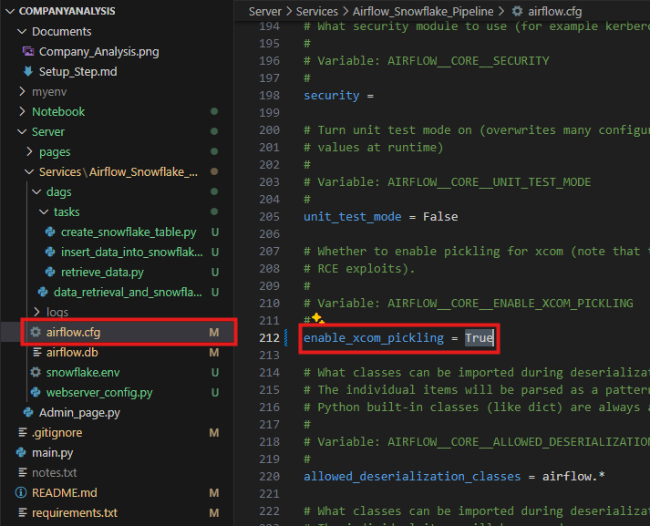
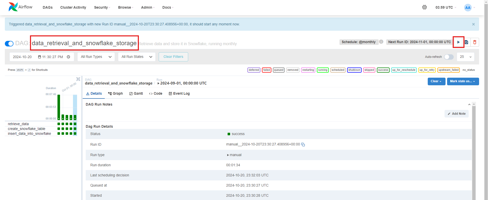

## I. Project Overview
The project aims to build a comprehensive system for analyzing the financial health of companies and predicting stock prices using historical macroeconomic data. The system will provide insights and forecasts, enabling better decision-making in financial investments.

---

## II. Tech Stack

##### 1. Data Collection & Preprocessing:
- **Python Libraries**: pandas, numpy, requests, yfinance, fredapi
- **APIs**: FRED (Federal Reserve Economic Data), yfinance

##### 2. Data Storage:
- **SQL Database** PostgreSQL for structured data storage
- **Snowflake Cloud Storage** for delta layers

##### 3. Data Analysis & Modeling:
- **Data Exploration**: pandas, matplotlib, seaborn
- **Feature Engineering**: scikit-learn
- **Models**:
  - **Company Health Analysis Model**: Random Forest, Gradient Boosting, XGBoost
  - **Stock Price Prediction Model**: Long Short-Term Memory (LSTM), Prophet, ARIMA for time series forecasting

##### 4. Model Evaluation:
- **Metrics**: R-squared, Mean Squared Error (MSE), Accuracy, Precision, Recall
- **Tools**: scikit-learn, TensorFlow/PyTorch (for deep learning models)

##### 5. User Interface:
- **Web Framework**: Streamlit and Flask (for web-based UI and APIs)
- **Frontend**: Streamlit UI components

---

## III. Project

#### 1. Objectives:
- Build a data-driven system that integrates historical macroeconomic data to analyze company health.
- Develop predictive models for stock price forecasting based on company and macroeconomic data.
- Create a user-friendly interface to provide insights and forecasts for investment decisions.

#### 2. Methodology

##### Data Collection
- Gather data from FRED API and yfinance.
- Store data in a structured format for analysis.

##### Data Preprocessing
- Clean and normalize the data.
- Engineer features for better model performance.

##### Modeling
- Build a health analysis model to classify companies based on financial stability.
- Develop a stock price prediction model using time series techniques.

##### Evaluation
- Validate models with real-world datasets.
- Adjust parameters to optimize accuracy and predictive power.

##### Deployment
- Develop a web-based UI for user interaction.
- Integrate models for real-time analysis and forecasting.

##### Expected Outcomes:
- Comprehensive analysis of company financial health based on macroeconomic data.
- Accurate prediction of stock prices for 1-month and 1-year timeframes.
- A user-friendly interface for investors and analysts.


#### 3. Resources Required:
- **Python libraries**: pandas, numpy, yfinance, fredapi, scikit-learn, TensorFlow/PyTorch, matplotlib, Streamlit, snowflake-connector-python
- **SQL Database** PostgreSQL
- **APIs**: FRED, yfinance
- **Cloud storage** Snowflake

---

## IV. Project Architecture



---

## V. Set Up Project

### A. Prerequisite

- #### **Set up project environment by the instruction**
  - **Note: If you using window, install WSL Ubuntu 24.04**
[Set Up Ubuntu 24.04 Instruction](./Documents/Setup_Step.md)

### B. Usage
**1. Before running the code examples, we have to clone the repository to your local machine:**

* Git Clone: Clone the repository to your local machine:
  
  ```bash
    git clone https://github.com/NolanMM/CompanyAnalysis.git
  ```

**2. Before running the code examples, make sure you have the virtual enviroment is installed and be ready to use:**

<details><summary>Instruction to create a new `Python 3.10` virtual enviroment for this project.</summary>

* If you want to create a new virtual enviroment, you can use the following command in the terminal of the project directory:

  * In Windows or Linux, you can use the following command:
  
  ```bash
    python -m venv venv
  ```

  * Then, you can activate the virtual enviroment by using the following command:
  
  ```bash
    venv\Scripts\activate
  ```

  * In MacOs, you can use the following command:
  
  ```bash
    python3 -m venv venv
  ```

  * Then, you can activate the virtual enviroment by using the following command:
  
  ```bash
    source venv/Scripts/activate
  ```

* Make sure the virtual environment needed for project is activate with corresponding project directory, you can use the following command:

  * In Windows or Linux, you can use the following command:
  
  ```bash
    venv\Scripts\activate
  ```

  * In MacOs, you can use the following command:
  
  ```bash
    source venv/Scripts/activate
  ```

* Install requirements.txt: Automatically installed dependencies that needed for the project:
  
  ```bash
    pip install -r requirements.txt
  ```

</details>

</br>

##### 3. Retrieve The Necessary API Keys

- 3.1 Retrieve The FRED API Keys Instruction
  - [Retrieve The FRED API Keys Instruction](./Documents/Images/Retrieve_FRED_API_Key.md)
- 3.2 Retrieve The Snowflake Connection Information Instruction
  - [Retrieve The Snowflake Connection Information Instruction](./Documents/Images/Create_Snowflake_Account_Connect_Python.md)
- 3.3 Input the FRED API key and Snowflake Connection Information into
  - **snowflake.env** file inside
   ```bash
   ./Server/Services/Airflow_Snowflake_Pipeline/snowflake.env
   ```
  <p align="center">
    
  </p>
  <br>

  - **Save the Change**

<details>

<summary><b>4. Set Up & Run Airflow Pipeline</b></summary>

<details><summary>Instructions to create a new `Python 3.10` virtual environment if not available.</summary>

* To create a new virtual environment, use the following command in the terminal of the project directory:

  * In Windows or Linux, use:
  
  ```bash
  python -m venv venv
  ```

  * Activate the virtual environment with:
  
  ```bash
  venv\Scripts\activate
  ```

  * In macOS, use:
  
  ```bash
  python3 -m venv venv
  ```

  * Activate the virtual environment with:
  
  ```bash
  source venv/bin/activate
  ```

* Ensure the virtual environment is activated in the corresponding project directory:

  * In Windows or Linux:
  
  ```bash
  venv\Scripts\activate
  ```

  * In macOS:
  
  ```bash
  source venv/bin/activate
  ```

* Install dependencies from `requirements.txt`:
  
  ```bash
  pip install -r requirements.txt
  ```

</details>


##### Configure Airflow Environment Path

Open The COMPANYANALYSIS Project Directory just Cloned in WSL terminal (Inside Python Virtual Environment)

```bash
export AIRFLOW_HOME="$(pwd)/Server/Services/Airflow_Snowflake_Pipeline"
export PATH="$PATH:$AIRFLOW_HOME"
echo $AIRFLOW_HOME
```

##### Initialize Airflow and Create Admin User

```bash
airflow db init
airflow users create --role Admin --username admin --email admin --firstname admin --lastname admin --password admin
```

##### Enable XCom Pickling

* Locate the line: `enable_xcom_pickling = True` (line 212 in the Airflow configuration file **(Project_Dir\Server\Services\Airflow_Snowflake_Pipeline\airflow.cfg)**).
  <p align="center">
    
  </p>
</br>

##### Start Airflow Services
**First start the schedule in Another Instance of WSL Terminal (Inside PyVirtualEnv)**
  - Open another instance of WSL terminal window 
  - Open the virtual environment inside project directory
  - Set up the Airflow path again:

    ```bash
    export AIRFLOW_HOME="$(pwd)/Server/Services/Airflow_Snowflake_Pipeline"
    export PATH="$PATH:$AIRFLOW_HOME"
    airflow scheduler
    ```
**Then start the Airflow in Current WSL Terminal (Inside PyVirtualEnv)**
  ```bash
  airflow webserver -p 8080
  ```
  - Open the web browser and go to: [http://localhost:8080](http://localhost:8080)
  - Log in with the admin credentials you created earlier. (admin, admin)
  - Find and Choose the Dag name ```Data_Retrieval_And_Snowflake_Storage``` -> Play button to trigger it to run
  <p align="center">
    
  </p>

</details>

---